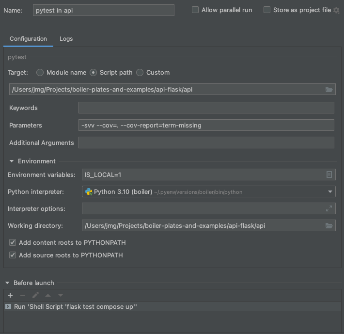
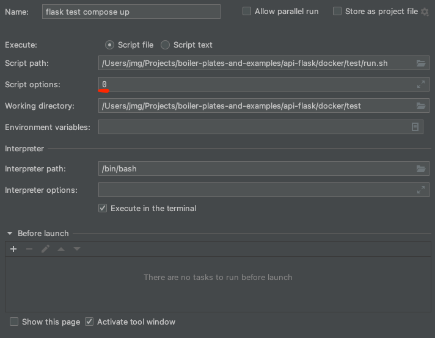

# API application with flask

## Run flask app

### Development environment
```bash
cd docker/base
./build_docker.sh
cd ../dev
./run.sh
```

If some configuration in python package requirements (ex. `requirements.txt`) has changed,
you should run this commands:
```bash
cd docker/base
./build_coker.sh
cd ../dev
./run.sh
```

If some configuration in `nginx.conf` has changed, please up container again:
```bash
cd docker/dev
./run.sh
```


### On local with flask cli
```bash
# On managing db
FLASK_APP=manage:app flask db init
FLASK_APP=manage:app flask db migrate
FLASK_APP=manage:app flask db upgrade
FLASK_APP=manage:app flask db downgrade 
```

## Testing flask app
### When running only using docker
```bash
cd docker/test
./run.sh
```

### When running on local environment
```bash
cd api
./test_local.sh
```

### With pycharm pytest with coverage
* pytest configuration  


* Before running pytest, script configuration  


* (Optional) tear down loaded test container  
```bash
# On api directory,
docker-compose -p api-flask-test -f ../docker/dev/docker-compose.yaml down

# Or at docker/dev directory,
docker-compose -p api-flask-test down
```
